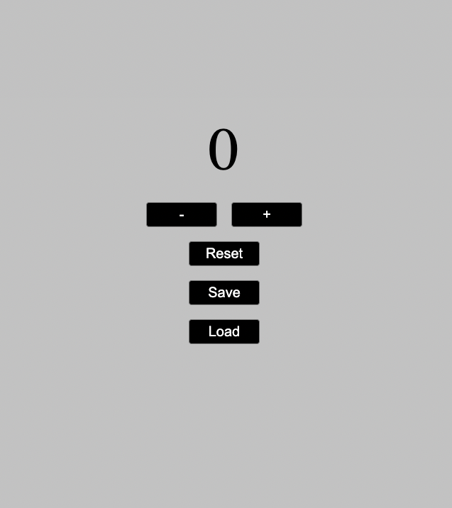

  <h1 align="center">Start2Impact JavaScript Basics Project</h1>

<!-- ABOUT THE PROJECT -->
## About The Project

This project is made during the course of study I am doing through the [Start2Impact](https://www.start2impact.it/) platform, to certify the skills learned.
It represents a simple counter that allows you to add, subtract, save and reset a numerical value.
The project is fine to comply with all the directions suggested by the [Start2Impact](https://www.start2impact.it/) team.

(<a href="#readme-top">back to top</a>)

### Built With:

* HTML5
* CSS3
* JavaScript

(<a href="#readme-top">back to top</a>)

<!-- CONTACT -->
## Contact

Start2Impact Profile: [https://talent.start2impact.it/profile/vittorio-gioda](https://talent.start2impact.it/profile/vittorio-gioda)

LikedIn: [https://www.linkedin.com/in/vittorio-gioda/](https://www.linkedin.com/in/vittorio-gioda/)

Project Link: [https://github.com/Teygeta/Project_Start2Impact_JS](https://github.com/Teygeta/Project_Start2Impact_JS)

(<a href="#readme-top">back to top</a>)

